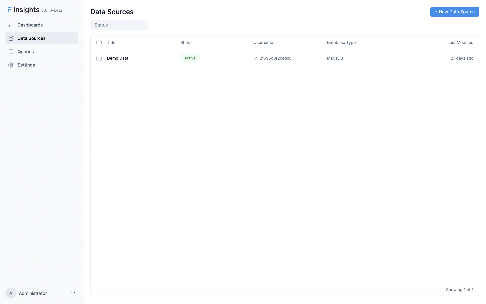
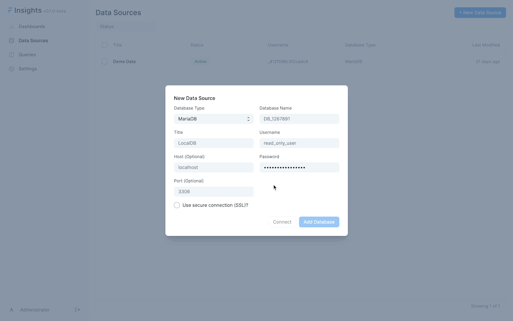

# Adding Data Sources

You can add a multiple Data Sources to process and combine data from different databases. You can add a data source from the Data Source page.

## Data Source List

Go to the **Data Sources** tab, and click on **New** to add a new source.

You will be prompted to enter your database credentials. You need to enter these credentials to connect to your database.

Here's what you will need to connect to your database:
- The **hostname** of the server where your database is (leave empty for localhost)
- The **port** of the database server (leave empty for default port)
- The **database name**
- The **username** you use for the database (preferably a user with read-only privileges)
- The **password** you use for the database

::: tip Use SSL
If you are connecting to a remote database, you must keep it enabled
:::

::: tip Connect to Frappe Cloud Site
If your site is hosted on Frappe Cloud, check out these [instructions](../miscellaneous/faq#q-my-site-is-hosted-on-frappe-cloud-how-do-i-connect-to-my-database) get the database credentials.
:::

