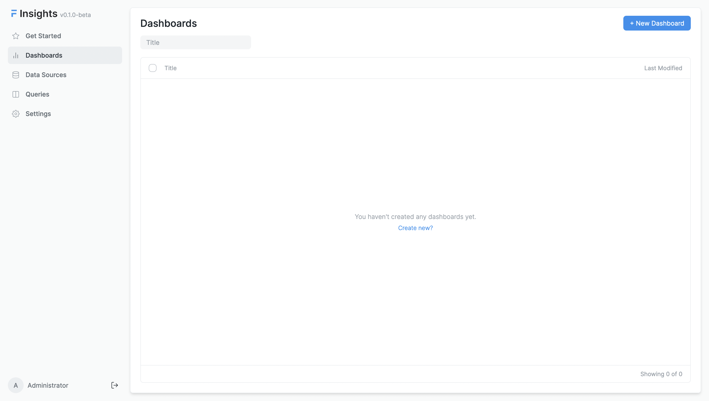

# Create your first dashboard

A Dashboard is a collection of visualizations created from queries. You can create a dashboard to track important metrics and ease the process with insightful reports and charts.

Go to the **Dashboards** tab, to create a new dashboard.

Let's create a dashboard to display the previously created visualizations.

---

Congratulations! You have gone through the basics of using Insights. You can now start using Insights to create your own dashboards.