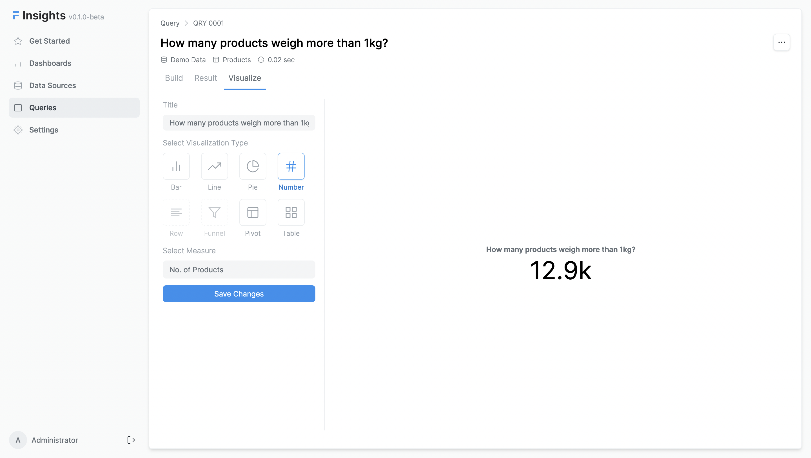

# Create your first query

The Query is the main component of Insights. Consider query as an object that stores summarised data. It is used to create visualizations and dashboards. 

## Query List

Go to the **Queries** tab, to create a new query.


To create a query, you need to select a data source and a table.


## Query Builder

Once you submit the form, you'll be redirected to Query Builder where you can create a query.


There are three main sections in the query builder:

- **Tables** - This section is used to select a table from the data source. You get options to join tables here.
- **Dimensions & Metrics** - This section is used to select dimensions and metrics. Dimensions are used to group data and metrics are used to calculate values.
- **Filters** - This section is used to select filters. You can add simple or advanced filters here. You can even write logical expressions here.

## Dimensions & Metrics

Since we have selected the Customers table, let's build a simple query to get the total number of customers. For this, we just need to add one metric that shows the count of records from the Customers table.


Now, let's build a query to get the top 10 states with the highest number of customers.


## Filters

Filters are used to narrow down the data. Let's find out how many of our products weigh more than 1kg


There are two types of filters:
- **Simple Filters** 
	- These filters are used to filter data based on standard operators.
	- Following operators are available in a simple filter
		- equals
		- not equals
		- greater than
		- less than
		- greater than equal to
		- less than equal to
		- one of
		- not one of
		- between
		- within

- **Expression Filters**
	- You can write complex expressions that returns a boolean value to filter data.
	- You can use logical operators to combine multiple expression filters.
	- For eg., ```(`Customer.city` = "CityA" && `Customer.state` = "StateB") || (`Customer.country` != "CountryA")```

## Visualize

Once you have created your summarised data, you can visualize it.
Let's visualize the query that shows products that weigh more than 1kg. Since it represents a number, we can use the **Number** type to visualize it.



For the query that shows the top 10 states with the highest number of customers, we can use the **Bar** type to visualize it.

