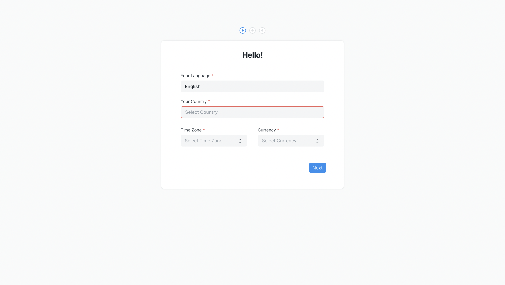

# Setup your account

Once you have installed Insights, you will need to set up your account. Visit your newly created site that has Insights installed, and you should see a setup wizard.

To complete the setup you will need to enter basic information like your country, name, email, and password. Make sure to remember your email and password as this is going to be your [admin account](/miscellaneous/faq#admin-account).

Next, you will be prompted to enter your database credentials. You need to enter these credentials to connect to your database. If you don't have these credentials ready you can choose to explore the demo database that is provided with Insights.

Here's what you will need to connect to your database:
- The **hostname** of the server where your database is
- The **port** of the database server
- The **database name**
- The **username** you use for the database - preferably a user with read-only privileges
- The **password** you use for the database

::: tip Use SSL
If your connection works with SSL enabled, you must keep it enabled
:::

::: tip Demo Data Setup
If you chose to explore the demo database, the setup might take longer than expected. It takes around ~3 minutes to set up the demo database.
:::

Once you have completed the setup, you will be redirected to Insights.

